# OCI AWS VPN (Site to Site IPSec VPN)
  ----------------------------------

## **Site-to-Site VPN (IPSec) between OCI and AWS**
#### **The Below document explains you How to setup IPSec VPN Connectivity between AWS and OCI using the built-in VPN Services offered by Oracle Cloud and AWS**
#### **We will explore the possibility to create an IPSec tunnel (or redundant IPSec tunnels, if we configure two separate VPN Connections) using the built-in VPN Services. Here we are not using any third party appliances.** 
#### **OCI is not offering the possibility to update a particular VPN Connection by changing the CPE (Customer-premises Equipment) used. AWS can update the CPE used for a given VPN Connection and thus, we will rely on this function to be able to create the IPSec tunnel to OCI.**

## **Target Architecture setup**
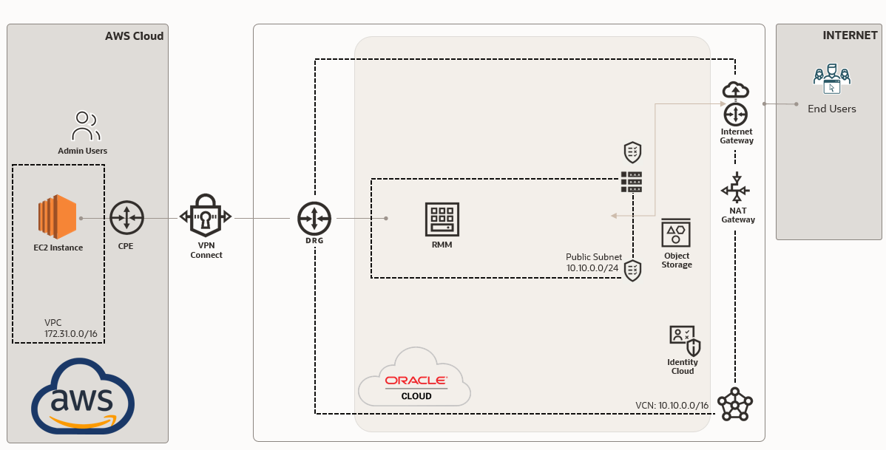

OCI CIDR Range : **10.10.0.0/16**

RMM Instance IP :  10.10.0.79

AWS CIDR Range : **172.31.0.0/16**

EC2 Instance IP : 172.31.42.142

### **Step 1 – Setting up non overlapping Private Networks**
Let’s make sure you have a VPC on AWS and a VCN on OCI with non overlapping CIDR ranges.

### **Step 2 – Creating the IPSEC tunnel on AWS**

You need to first setup the IPSEC (Site-to-Site VPN Connection) on AWS. As only AWS allows you later to change the Customer Gateway/Customer-Premises Equipment.

You first need to create a “dummy” Customer Gateway, as you do not know the IP address of the OCI IPSEC gateway yet.

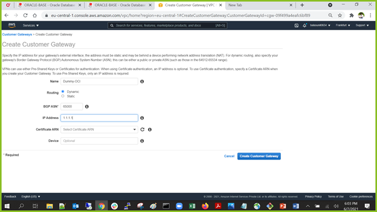

You can specify pretty much anything you want, as you will later create a new Customer Gateway with the correct information.

Next, you need to create a Virtual Private Gateway, this will be the routing service on the AWS side (like the DRG on OCI).

After the Virtual Private Gateway is created, attach it to your VPC.

In this case we have already created a VPC called MYVPC (172.31.0.0/16)

Now you can create on AWS side the IPSEC tunnel (Site-to-Site VPN Connection). Let’s call this AWS-to-OCI-1, #1 because if you want a redundant connection you later need to connect a 2nd one. Make sure you have the Routing Options set to **Dynamic (requires BGP)**

All the other settings (tunnel settings) can stay as-default empty.

Once done You can see the VPN state is pending, which means the VPN is getting provisioned,. It take around 3 to 5 minutes. Meanwhile we can start the configuration part in OCI

Download the configuration. You will need the information from that document to setup the IPSEC tunnels on OCI

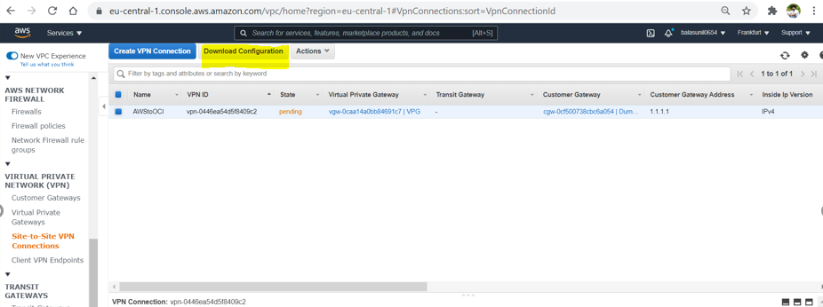

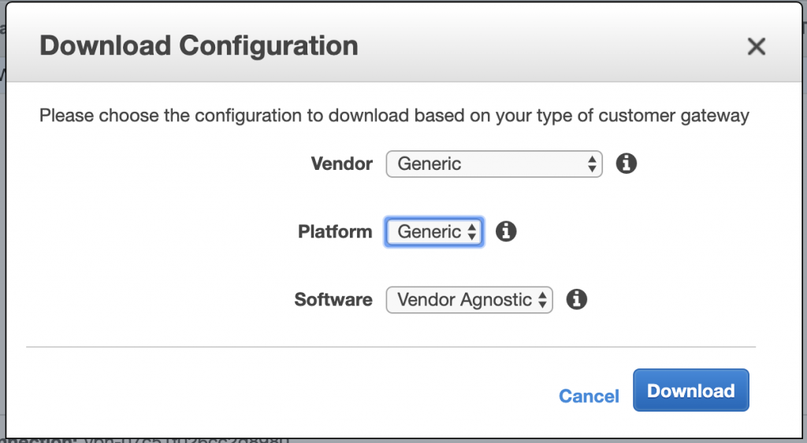

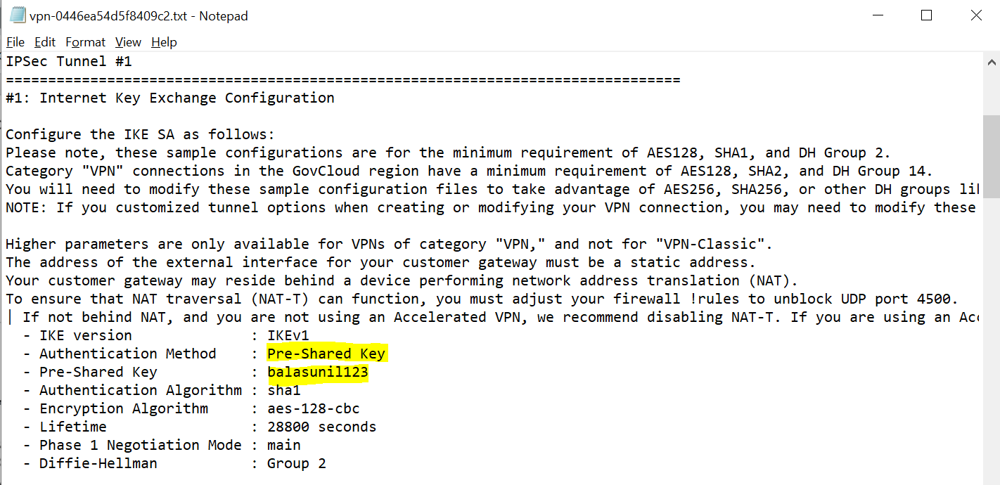

**IMPORTANT:** Check that the Pre-Shared key ONLY contains Letters and Numbers. OCI does not support . and \_ !! (while AWS does, but AWS does not support spaces). You can also specify your own Pre-shared keys, so you can make sure you only have Letters and Numbers.

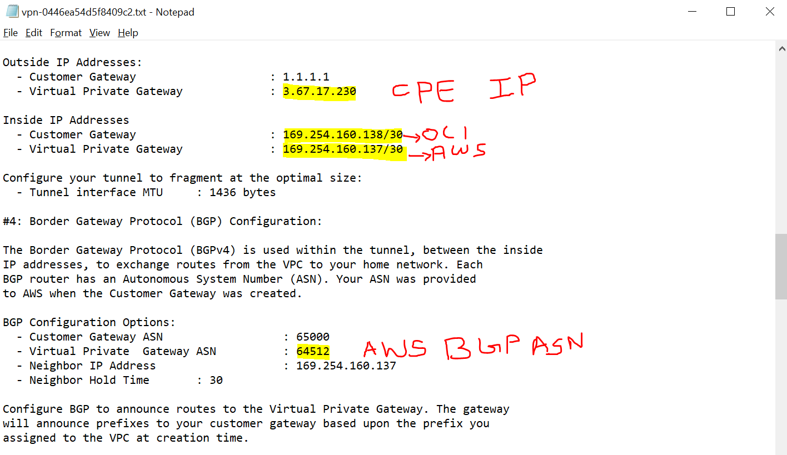

Note the above parameters which require to setup the tunnel in OCI side

### **Step 3 – Creating the IPSEC tunnel on OCI**
The first thing in OCI you need to create is a “Customer-Premises Equipment”, in this case not really a “customer-premises” but you will do this for the AWS-Premise

If your VCN does not have a DRG (Dynamic Routing Gateway) yet, make sure you create one. You will find the DRG option again in the networking menu.

In this case the DRG name is **aws-drg**

Now you can create a new IP SEC connection. You will find the IP SEC Connections also in the network menu.

**IMPORTANT:** Before you click on “Create IPSec Connection”, click on the “Show Advanced Options”!!!

You need to configure the Tunnel 1 and Tunnel 2 Settings, see the below image. Collect the required information from the downloaded configuration. I have highlighted the required  information in the above configuration screenshot 

`                                                                                                                                            `

For tunnel 2, you just need to provide “dummy” information. Do make sure you set routing type to BGP.

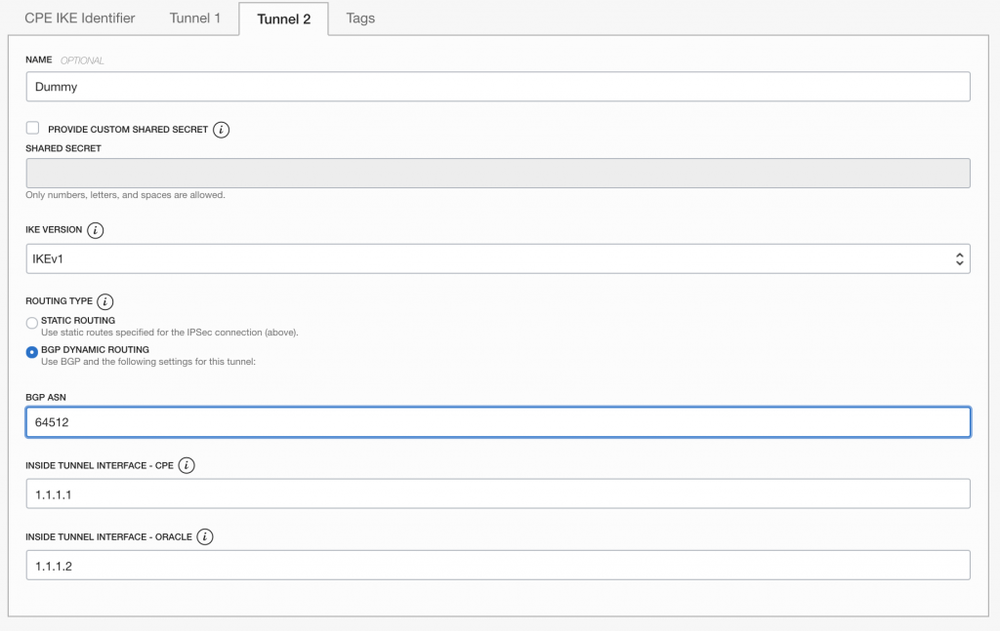

You will now see the Public IP address for the “AWS-Tunnel1” on the OCI side. In my case **132.145.249.175**. With this you now need to go back to AWS and create a new Customer Customer Gateway.

Collect the BGP information like oracle ASN  from the primary tunnel 

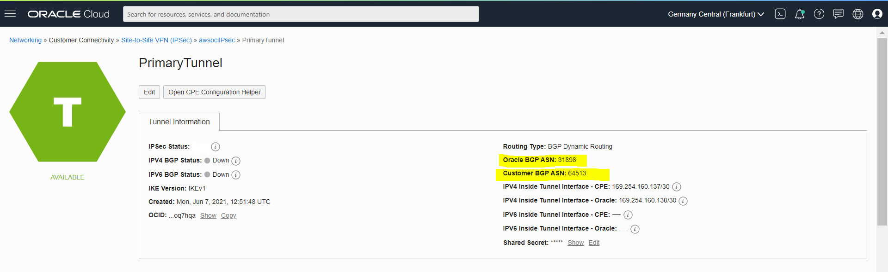

### **Step 3 – Create Correct New Customer Gateway on AWS**

Again Go back to the AWS to replace the DUMMY customer gateway with the correct one to establish the connectivity. 

For this gateway, use the IP Address of the Oracle VPN (not the dummy tunnel) and set the BGP ASN to Oracle = 31898.

After this is created, go to the Site-to-Site VPN Connection and click on “Actions – > Modify VPN Connection”

Change the target type for the Customer Gateway, and select here the newly (correct) configured Custer Gateway (that is using the actual OCI VPN IP).

You are almost there! After AWS is done modifying the VPN Connection you should see on both sides that the tunnel is up.

## ***Yah !!! Now the tunnel us UP on both Sides *** 

AWS Side

OCI Side

Now add the required routes in both sides to test the tunnel connectivity

Update Route table in AWS Side

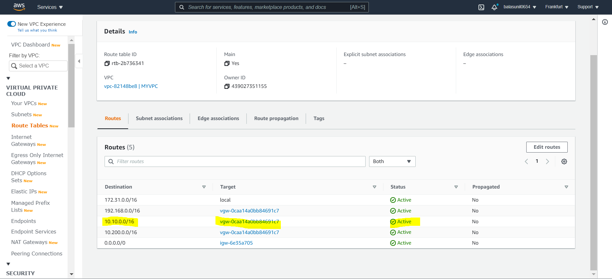 

Update Route table in OCI Side

Yeah Now Its the time to test the connectivity
# **AWS to OCI                                                                                                                      
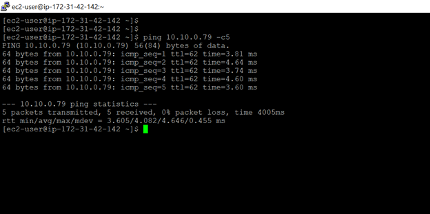  

# **OCI to AWS**
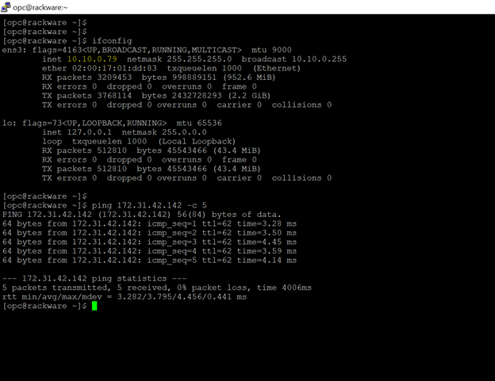

## ***I hope the above document helps !!!! You can reach out to me anytime if you need any clarification !!!***

Thank you 

Bala Sunil

balasubramannyam.sunil@oracle.com

